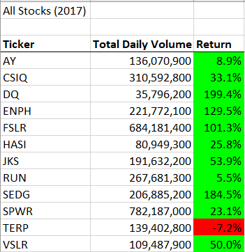
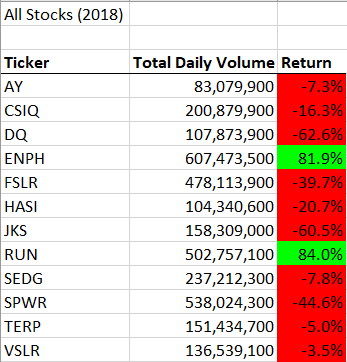
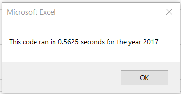
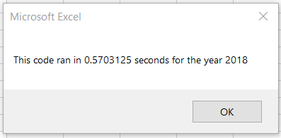
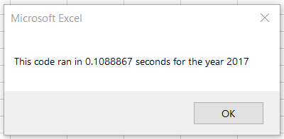
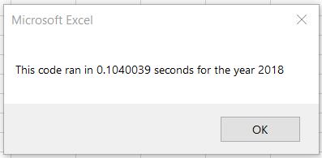

# Stock Analysis with VBA

## Overview
The data for 12 green energy stocks in the years 2017 and 2018 are stored in an Excel workbook. Each stock is  
described by the stock ticker, date, opening, closing and adjusted closing prices, highest and lowest prices, and  
daily trading volume.  
  
## Purpose
To indicate if the stock is worth investing in, a VBA script for the file was written to retrieve and clearly  
display the total daily volume and return on each stock. The purpose of this project was to refactor that code to  
better compile and print stock information, without altering the results. The ouput and program execution times were  
factors used to compare the effiency of each code.  
  
# Results
The images below show the results of the script. Many stocks experienced losses in 2018, except ENPH and RUN.  
These stocks were both in the top quarter and had positive returns in both years.  


  
The runtimes for each year of both the original and refactored VBA code below:  
  
*Original code*  


*Refactored code*  


  
# Summary
  
## Advantages and Disadvantages of Refactoring
The main benefit of refactoring is that it leads to higher-quality code, characterized by being efficent, clean, and  
well-organized. These attributes lend themselves to improved design, faster performance, and simplifies readability  
and debugging. This also helps by making it easier to maintain. However, refactoring can also introduce risks if the  
existing code has a large application or if the code is overly complex and not well-understood. Trying to refactor  
code in this state may be too time consuming or damage its functionality.  
  
## Original vs. Refactored VBA code
Sections of each code are included below for reference (some lines ommited for clarity).  
***Original***
```
'Loop through tickers  
For t = 0 To 11  
  
    totalVolume = 0  
  
    'Loop over rows  
    For i = 2 To rowEnd  
  
        'Add to volume of current ticker  
        If Cells(i, 1) = tickers(t) Then  
            'Increase total volume counter  
            totalVolume = totalVolume + Cells(i, 8).Value  
  
            'Check if inital ticker  
            If Cells(i - 1, 1).Value <> tickers(t) Then  
                'Set starting price  
                startPrice = Cells(i, 6).Value  
            End If  
            'Check if last ticker  
            If Cells(i + 1, 1).Value <> tickers(t) Then  
                'Set ending price  
                endPrice = Cells(i, 6).Value  
            End If  
        End If  
  
    Next i  
Next t
```
***Refactored***
```
'1a) Create a ticker Index  
tickerIndex = 0  
  
'1b) Create three output arrays  
Dim tickerVolumes(12) As Long  
Dim tickerStartingPrices(12) As Single  
Dim tickerEndingPrices(12) As Single  
  
'2a) Create a for loop to initialize the tickerVolumes to zero.  
For t = 0 To 11  
    tickerVolumes(t) = 0  
Next t  
  
'2b) Loop over all the rows in the spreadsheet.  
For i = 2 To RowCount  
  
    '3a) Increase volume for current ticker  
    If Cells(i, 1) = tickers(tickerIndex) Then  
        tickerVolumes(tickerIndex) = tickerVolumes(tickerIndex) + Cells(i, 8).Value  
    End If  
  
    '3b) Check if the current row is the first row with the selected tickerIndex.  
    If Cells(i - 1, 1).Value <> tickers(tickerIndex) Then  
        'Set starting price  
        tickerStartingPrices(tickerIndex) = Cells(i, 6).Value  
    End If  
  
    '3c) Check if the current row is the last row with the selected ticker  
    If Cells(i + 1, 1).Value <> tickers(tickerIndex) Then  
        'Set ending price  
        tickerEndingPrices(tickerIndex) = Cells(i, 6).Value  
        '3d Increase the tickerIndex.  
        tickerIndex = tickerIndex + 1  
    End If  
  
Next i  
```
The refactored code succeeded in increasing overall efficiency, shown in the comparative execution times. The  
original took ~0.50 seconds  to run while the  refactored code was 80% faster at ~0.10 seconds. While both codes  
loop through each row, the final, refactored code runs faster by transforming analogous variables into the  
`tickerVolumes`, `tickerStartingPrices`, and `tickerEndingPrices` arrays that can store the corresponding values for  
each ticker in a single loop. The original code loops through each row for every loop ticker, while the refactored  
code loops through each ticker separately and through each row once, resulting in one less order of magnitude  
difference in actions required by the refactored code than the original. While both codes produce the same result,  
removing the nested for loop lowered the execution time and made the code easier to understand.
